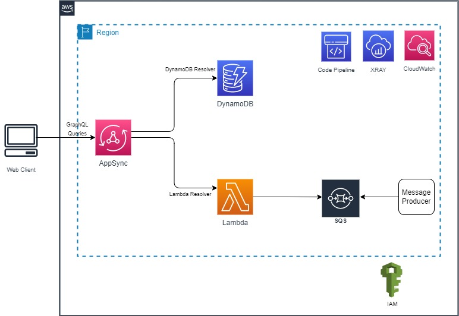
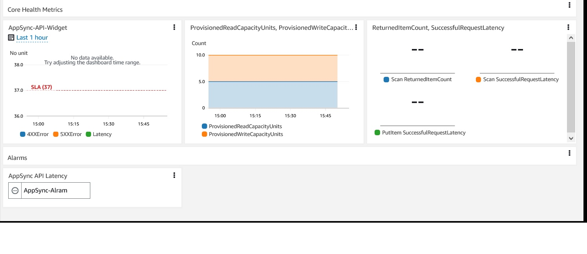

# appsync-websocket-api

These [AWS AppSync](https://aws.amazon.com/appsync/) examples demonstrate end-to-end implementations of a simple application using serverless approach that showcase AWS AppSync built in functionality to connect to multiple data sources using a single GraphQL API. The examples include two implementations of the same application using a variety of development platform and infrastructure as a code approaches. The examples dive deeper to include: 123

- Automated deployment using CI/CD pipelines.
- Automated unit and integration testing.
- Infrastructure as Code using [AWS SAM](https://aws.amazon.com/serverless/sam/) and [AWS CDK](https://aws.amazon.com/serverless/sam/) approaches.
- Observability: Logging & Monitoring using [Amazon CloudWatch](https://aws.amazon.com/cloudwatch/) and [AWS XRAY](https://aws.amazon.com/xray/). Including CloudWatch alarms and dashboard.
- business specific metrics

The services used by this application include [AWS AppSync](https://aws.amazon.com/appsync/), [Amazon DynamoDB](https://aws.amazon.com/dynamodb/), [AWS Lambda](https://aws.amazon.com/lambda/), [Amazon SQS](https://aws.amazon.com/sqs/), [Amazon CloudWatch](https://aws.amazon.com/cloudwatch/), [AWS XRAY](https://aws.amazon.com/xray/), [AWS IAM](https://aws.amazon.com/iam/), [AWS CloudFormation](https://aws.amazon.com/cloudformation/), [AWS SAM](https://aws.amazon.com/serverless/sam/), [AWS CDK](https://aws.amazon.com/cdk/), and [AWS CodePipeline](https://aws.amazon.com/codepipeline/).

## Architecture

The examples uses AWS AppSync as the front door to the client application. The client application will use API_KEY to authenticate with AppSync. In AppSync you will define persistent storage as the data source, a schema that defines the shape of the data that flows through your API and also the operations that can be performed. Finally, you will define AppSync resolvers which are functions that convert the GraphQL payload to the underlying storage/target service using [VTL](https://velocity.apache.org/engine/1.7/user-guide.html) which contains transformation and execution logic.

## Use Cases

The examples use a fictitious sports application where the end user can create soccer teams of his/her choice, add players and query their favorite teams based on selected players and team ranking. The examples cover two use cases.

- DynamoDB integration - We utilize DynamoDB resolvers and VTL request/response templates in conjunction with single table design pattern to update the datasource using AppSync mutation. In a single table design all datatypes are stored within a single DynamoDB table and this can be a very efficient way of perfomring CRUD operations on a DynamoDB table using a single API call. This is a reccommended architecture when data access patterns are known before you begin building your tables and GraphQL schema.

- Websocket "out of band" integration - We demonstrate enabling real-time data updates through the use of GraphQL subscriptions. An "out of band" update happens when a component of the system alters data independent of an AppSync mutation.  We implement this by having a message producer places a message on an SQS queue which would trigger an AppSync mutation that publishes data to subscribed clients in real time using the WebSocket protocol.

## Components created

The sample application will create the following resources in your AWS account:

- AWS AppSync - GraphQL API that uses AppSync as a front door to the sample application
- Amazon DynamoDB - NoSQL database to store soccer teams/players data
- AWS IAM - roles and permissions for different AWS services included in the solution
- Amazon SQS- queues to receive message from a message producer. Message will be sent to the client via AppSync
- Amazon CloudWatch- For logging and monitoring
- AWS XRAY- For tracing and troubleshooting
- AWS SAM - For IaC to automate solution deployment

## Observability configurations

Each example implements logging using CloudWatch Logs, emits CloudWatch metrics, configures CloudWatch alerts, and creates a CloudWatch dashboard. X-Ray distributed tracing is enabled whenever it is supported. The CloudWatch Logs emit metrics for Request Level Logs and Field Level Logs. For more details on AWS AppSync Logging & Monitoring please see [documentation](https://docs.aws.amazon.com/appsync/latest/devguide/monitoring.html).

Check the CloudFormation outputs of your deployment to see the CloudWatch dashboard URL. To receive alerts you will need to create a subscription for the SNS topic. Please see [documentation](https://docs.aws.amazon.com/sns/latest/dg/sns-create-subscribe-endpoint-to-topic.html)

## Testing  

The sample application will include unit and integration testing that are automatically run as part of the CI/CD pipeline.

## Deploying the sample application

The sample application is deployed via a CI/CD pipeline. As part of the pipeline, a code repository will be created to store the application code, as well as two environments - staging and production. Each of the environments will have all necessary resources. The build stage will automatically perform all unit tests and Staging will run integration tests.

*See individual example documentation for detailed instructions on how to create the CI/CD pipeline.*

## Sample Applications

Check these implementations of the example AppSync API for more details.

- [AppSync-GraphQL-sam-cdk](./AppSync-GraphQL-sam-cdk) - this GraphQL API implementation uses AWS AppSync, Amazon DynamoDB, AWS Lambda, Amazon SQS, Amazon CloudWatch, AWS IAM, AWS XRAY, AWS SAM, AWS CloudFormation, AWS CodePipeline and AWS CDK.
